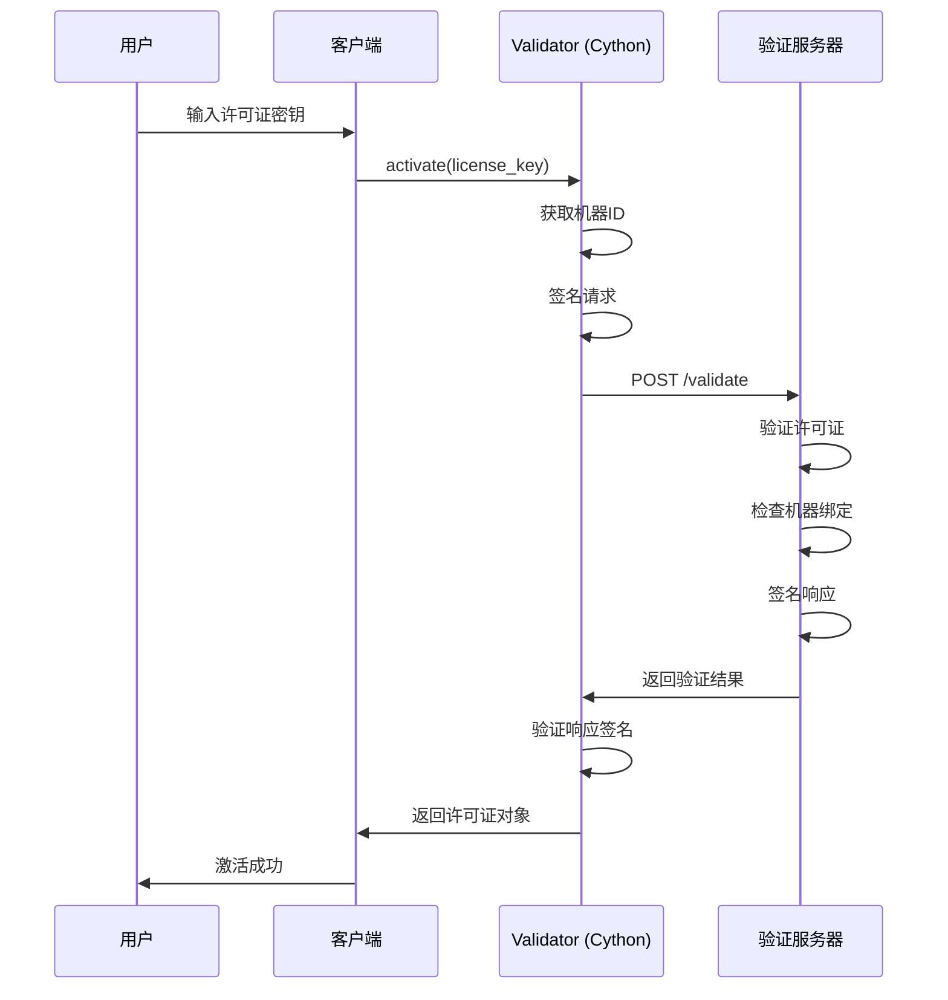

# TradingAgents-CN 混合编译策略

## 📋 概述

为了保护商业版核心代码，特别是许可证验证逻辑，我们采用**混合编译策略**：

### 编译策略

```
core/
├── licensing/          # 🔐 Cython编译 → C扩展 (.pyd/.so)
│   ├── validator.py    # 在线验证器（最关键）
│   ├── manager.py      # 许可证管理器
│   ├── features.py     # 功能门控
│   └── models.py       # 数据模型（保留源码）
├── agents/             # 📦 字节码编译 → .pyc
├── workflow/           # 📦 字节码编译 → .pyc
├── llm/                # 📦 字节码编译 → .pyc
└── ...                 # 📦 字节码编译 → .pyc
```

---

## 🎯 为什么采用混合策略？

### 问题：原有许可证验证的安全漏洞

**原代码**（`core/licensing/manager.py`）：
```python
def activate(self, license_key: str) -> bool:
    # 简单的本地验证
    parts = license_key.split('-')
    tier_str = parts[0].lower()
    tier = LicenseTier(tier_str)
    
    # 直接激活！
    self._license = License.create_for_tier(tier)
    return True
```

**漏洞**：
- ❌ 用户输入 `pro-1234-5678-9012` 就能激活Pro版
- ❌ 没有在线验证
- ❌ 代码是明文的，用户可以直接修改 `activate()` 方法返回 `True`

---

### 解决方案：Cython编译 + 在线验证

**新代码**（`core/licensing/validator.py`）：
```python
class LicenseValidator:
    # 🔐 验证服务器地址（编译后无法修改）
    VALIDATION_SERVER = "https://license.tradingagents.cn/api/v1"
    
    # 🔐 密钥（编译后无法查看）
    SECRET_KEY = b"your-secret-key"
    
    def validate_online(self, license_key: str):
        # 1. 获取机器ID（硬件绑定）
        machine_id = self._get_machine_id()
        
        # 2. 签名请求（防篡改）
        signature = self._sign_request({
            "license_key": license_key,
            "machine_id": machine_id,
        })
        
        # 3. 发送到验证服务器
        response = requests.post(
            f"{self.VALIDATION_SERVER}/validate",
            json={"license_key": license_key, "signature": signature}
        )
        
        # 4. 验证响应签名
        if self._verify_signature(response.json()):
            return True, license_obj
        
        return False, None
```

**编译后**：
- ✅ 用户无法查看 `SECRET_KEY`
- ✅ 用户无法修改 `VALIDATION_SERVER`
- ✅ 用户无法绕过在线验证
- ✅ 硬件绑定防止许可证共享

---

## 🛡️ 安全特性

### 1. Cython编译（licensing目录）

**保护级别**：⭐⭐⭐⭐⭐（最高）

**特点**：
- 编译为C扩展（.pyd on Windows, .so on Linux）
- 反编译难度极高（需要逆向工程C代码）
- 性能提升10-30%

**保护内容**：
- 许可证验证逻辑
- 验证服务器地址
- 签名密钥
- 硬件绑定算法

### 2. 字节码编译（其他目录）

**保护级别**：⭐⭐⭐（中等）

**特点**：
- 编译为Python字节码（.pyc）
- 反编译难度中等（需要工具如uncompyle6）
- 移除文档字符串（-OO优化）

**保护内容**：
- 工作流引擎
- 智能体系统
- LLM客户端
- 其他业务逻辑

---

## 🚀 使用方法

### 方法1：一键打包（推荐）

```powershell
# 自动同步、编译、打包
.\scripts\deployment\build_pro_package.ps1
```

这个脚本会：
1. 同步代码（排除课程源码）
2. **混合编译core目录**
3. 构建前端
4. 打包为ZIP

### 方法2：手动编译

```powershell
# 1. 同步代码
.\scripts\deployment\sync_to_portable_pro.ps1

# 2. 混合编译
.\scripts\deployment\compile_core_hybrid.ps1

# 3. 打包
.\scripts\deployment\build_portable_package.ps1 -SkipSync
```

---

## 📊 编译结果对比

### 编译前

```
core/licensing/
├── __init__.py         (源码)
├── manager.py          (源码, 176行)
├── validator.py        (源码, 260行)
├── features.py         (源码, 140行)
└── models.py           (源码, 156行)
```

### 编译后

```
core/licensing/
├── __init__.py         (清空)
├── manager.pyd         (C扩展, 无法查看)
├── validator.pyd       (C扩展, 无法查看)
├── features.pyd        (C扩展, 无法查看)
└── models.py           (保留, 被其他模块导入)
```

---

## 🔐 许可证验证流程

### 用户激活流程



### 功能调用流程

```python
from core.licensing import require_feature

@require_feature("sector_analyst")
def analyze_sector(ticker: str):
    # 此函数只有Pro用户可以调用
    # 验证逻辑在Cython编译的代码中，无法绕过
    pass
```

---

## ⚙️ 配置验证服务器

### 环境变量

```bash
# .env
LICENSE_SERVICE_URL=https://license.tradingagents.cn/api/v1
LICENSE_SERVICE_TIMEOUT=10
LICENSE_CACHE_TTL=3600
```

### 验证服务器API

**端点**: `POST /api/v1/validate`

**请求**:
```json
{
  "license_key": "pro-xxxx-xxxx-xxxx",
  "machine_id": "abc123...",
  "timestamp": 1704355200,
  "signature": "sha256_hmac_signature"
}
```

**响应**:
```json
{
  "valid": true,
  "license": {
    "id": "uuid",
    "tier": "pro",
    "user_email": "user@example.com",
    "expires_at": "2025-12-31T23:59:59",
    "features": { ... }
  },
  "signature": "response_signature"
}
```

---

## 🧪 测试

### 测试编译结果

```powershell
# 1. 测试core模块导入
python -c "import core; print(core.__version__)"

# 2. 测试许可证管理器
python -c "from core.licensing import LicenseManager; m = LicenseManager(); print(m.tier)"

# 3. 测试验证器（离线模式）
python -c "from core.licensing.validator import LicenseValidator; v = LicenseValidator(offline_mode=True); print(v.validate_offline('pro-test-12345678-abcd1234'))"
```

### 测试许可证激活

```python
from core.licensing import LicenseManager

manager = LicenseManager()

# 尝试激活（会调用在线验证）
success, error = manager.activate("pro-xxxx-xxxx-xxxx")

if success:
    print(f"激活成功！级别: {manager.tier}")
else:
    print(f"激活失败: {error}")
```

---

## 📝 注意事项

### 1. Cython依赖

**Windows**:
```powershell
# 安装Cython
pip install Cython

# 安装Visual Studio Build Tools
# https://visualstudio.microsoft.com/downloads/
```

**Linux**:
```bash
pip install Cython
sudo apt-get install build-essential python3-dev
```

### 2. 跨平台编译

Cython编译的扩展是**平台相关**的：
- Windows: `.pyd` 文件
- Linux: `.so` 文件
- macOS: `.so` 文件

**解决方案**：
- 为每个平台单独编译
- 或者只在Windows上使用Cython，其他平台使用字节码

### 3. 调试

编译后的代码难以调试，建议：
- 开发时使用源码
- 发布时使用编译版本
- 保留详细的日志

---

## 🔄 更新流程

### 更新许可证验证逻辑

1. 修改 `core/licensing/validator.py`
2. 运行编译脚本
3. 测试验证功能
4. 打包发布

### 更新其他核心代码

1. 修改相应文件
2. 运行混合编译脚本
3. 测试功能
4. 打包发布

---

## 📞 故障排查

### 问题1: Cython编译失败

**症状**: `error: Microsoft Visual C++ 14.0 or greater is required`

**解决**:
```powershell
# 安装Visual Studio Build Tools
# 或者跳过Cython编译
.\scripts\deployment\compile_core_hybrid.ps1 -SkipCython
```

### 问题2: 导入错误

**症状**: `ImportError: cannot import name 'LicenseValidator'`

**解决**:
```powershell
# 检查编译产物
Get-ChildItem "release\TradingAgentsCN-portable\core\licensing" -Recurse

# 应该看到 .pyd 或 .pyc 文件
```

### 问题3: 许可证验证失败

**症状**: `网络错误: Connection refused`

**解决**:
- 检查验证服务器是否运行
- 检查网络连接
- 使用离线模式测试

---

**最后更新**: 2026-01-04

