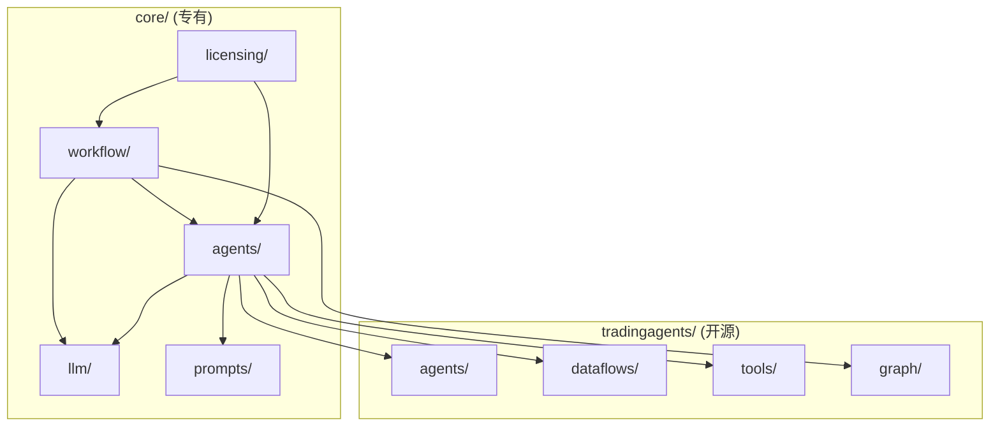

# Core 模块详细设计

## 📋 模块概述

`core/` 目录是收费版的核心模块，包含以下子模块：

```
core/
├── __init__.py
├── LICENSE                     # 专有许可证
│
├── workflow/                   # 工作流引擎
│   ├── __init__.py
│   ├── models.py               # 工作流数据模型
│   ├── engine.py               # 动态执行引擎
│   ├── builder.py              # 图构建器
│   ├── serializer.py           # JSON ↔ Graph 序列化
│   ├── validator.py            # 工作流验证
│   └── templates/              # 预设工作流模板
│       ├── default.json        # 默认分析流程
│       ├── quick_analysis.json # 快速分析
│       └── deep_research.json  # 深度研究
│
├── llm/                        # 统一 LLM 层
│   ├── __init__.py
│   ├── unified_client.py       # 统一客户端
│   ├── providers/              # LLM 提供商适配
│   │   ├── base.py             # 基础适配器
│   │   ├── openai_compat.py    # OpenAI 兼容
│   │   ├── google.py           # Google 特殊处理
│   │   └── anthropic.py        # Anthropic 特殊处理
│   ├── tool_normalizer.py      # 工具调用标准化
│   └── response_parser.py      # 响应解析器
│
├── agents/                     # 智能体系统
│   ├── __init__.py
│   ├── base.py                 # 智能体基类
│   ├── registry.py             # 智能体注册表
│   ├── factory.py              # 智能体工厂
│   ├── config.py               # 智能体配置
│   └── builtin/                # 内置高级智能体
│       ├── __init__.py
│       ├── sector_analyst.py   # 行业/板块分析师
│       └── index_analyst.py    # 大盘/指数分析师
│
├── prompts/                    # 提示词管理增强
│   ├── __init__.py
│   ├── manager.py              # 提示词管理器
│   ├── storage.py              # 存储后端
│   ├── renderer.py             # 模板渲染
│   └── versioning.py           # 版本控制
│
└── licensing/                  # 授权管理
    ├── __init__.py
    ├── manager.py              # 许可证管理
    ├── features.py             # 功能开关
    ├── validator.py            # 许可证验证
    └── usage_tracker.py        # 用量跟踪
```

---

## 🔄 模块依赖关系



---

## 📊 开源 vs 商业功能划分

| 功能 | 开源版 (tradingagents) | 商业版 (core) |
|------|------------------------|---------------|
| 基础智能体 | 4 个分析师 | 扩展分析师 |
| 工作流 | 固定流程 | 可视化定义 |
| LLM 支持 | 各自适配器 | 统一客户端 |
| 提示词 | 硬编码/基础模板 | 动态管理+版本控制 |
| 授权 | 无限制 | 功能分级 |

---

## 🔐 授权功能分级

| 功能 | 免费版 | 基础版 | 专业版 | 企业版 |
|------|--------|--------|--------|--------|
| 预设工作流 | 1 个 | 5 个 | 无限 | 无限 |
| 自定义工作流 | ❌ | 3 个 | 无限 | 无限 |
| 智能体数量 | 4 个 | 6 个 | 10 个 | 无限 |
| 并发分析 | 1 | 3 | 10 | 无限 |
| 提示词自定义 | ❌ | ❌ | ✅ | ✅ |
| API 调用/天 | 50 | 500 | 5000 | 无限 |
| 历史报告 | 7 天 | 30 天 | 365 天 | 永久 |
| 团队协作 | ❌ | ❌ | ❌ | ✅ |
| 技术支持 | 社区 | 邮件 | 优先 | 专属 |

---

## 📝 下一步

详细设计文档：
- [03-workflow-engine.md](./03-workflow-engine.md) - 工作流引擎
- [04-unified-llm.md](./04-unified-llm.md) - 统一 LLM 客户端
- [05-agent-system.md](./05-agent-system.md) - 智能体系统

