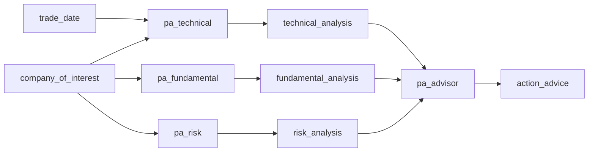

# 状态层设计 (State Layer Design)

## 问题分析

### 当前架构的状态传递问题

#### 1. 状态定义硬编码

**问题位置**：
- `tradingagents/agents/utils/agent_states.py` - AgentState 类
- `core/workflow/builder.py` - WorkflowState 类（第1030-1089行）

```python
# 当前硬编码的状态字段
class AgentState(MessagesState):
    company_of_interest: Annotated[str, "..."]
    market_report: Annotated[str, "..."]     # ❌ 硬编码
    news_report: Annotated[str, "..."]       # ❌ 硬编码
    fundamentals_report: Annotated[str, "..."]  # ❌ 硬编码
    # ... 更多硬编码字段
```

#### 2. 输入输出字段未定义

每个 Agent 需要哪些输入、产出哪些输出，没有明确定义：

```python
# 当前：Agent 输出字段靠约定
def market_analyst_node(state):
    # 知道要写入 market_report，但这是隐式约定
    return {"market_report": analysis_result}

# 理想：Agent 声明输入输出
@register_agent(
    inputs=["company_of_interest", "trade_date"],
    outputs=["market_report"]
)
class MarketAnalyst(BaseAgent): ...
```

#### 3. Workflow 状态与 Agent 状态不匹配

不同工作流需要不同的状态字段，但当前是统一的 AgentState：

| 工作流 | 需要的状态字段 |
|--------|---------------|
| 完整分析 | market_report, news_report, investment_plan, final_decision |
| 持仓分析 | technical_analysis, fundamental_analysis, risk_analysis, action_advice |
| 交易复盘 | trade_info, timing_analysis, emotion_analysis, review_summary |

## 设计目标

1. **声明式状态定义**：Agent 声明自己的输入/输出字段
2. **动态状态生成**：Workflow 根据包含的 Agent 自动生成状态 Schema
3. **类型安全**：状态字段有明确的类型定义
4. **可配置性**：状态字段可通过数据库配置

## 核心设计

### 1. Agent 输入输出声明

#### AgentIODefinition 模型

```python
# core/state/models.py
from pydantic import BaseModel
from typing import List, Optional, Dict, Any, Type
from enum import Enum

class FieldType(str, Enum):
    STRING = "string"
    INT = "int"
    FLOAT = "float"
    BOOL = "bool"
    LIST = "list"
    DICT = "dict"
    MESSAGES = "messages"  # LangChain 消息列表

class StateFieldDefinition(BaseModel):
    """状态字段定义"""
    name: str                              # 字段名
    type: FieldType                        # 字段类型
    description: str = ""                  # 字段描述
    default: Optional[Any] = None          # 默认值
    required: bool = False                 # 是否必需
    reducer: Optional[str] = None          # 并发合并函数

class AgentIODefinition(BaseModel):
    """Agent 输入输出定义"""
    agent_id: str
    
    # 输入字段（从 state 读取）
    inputs: List[StateFieldDefinition] = []
    
    # 输出字段（写入 state）
    outputs: List[StateFieldDefinition] = []
    
    # 可选：也读取其他 Agent 的输出
    reads_from: List[str] = []  # 其他 Agent 的输出字段名
```

#### 在 Agent 注册时声明

```python
# core/agents/decorators.py
def register_agent(
    id: str,
    name: str,
    category: str,
    inputs: List[Dict] = None,      # 输入字段定义
    outputs: List[Dict] = None,     # 输出字段定义
    reads_from: List[str] = None,   # 依赖其他 Agent 的输出
    **kwargs
):
    def decorator(cls):
        io_def = AgentIODefinition(
            agent_id=id,
            inputs=[StateFieldDefinition(**f) for f in (inputs or [])],
            outputs=[StateFieldDefinition(**f) for f in (outputs or [])],
            reads_from=reads_from or []
        )
        
        AgentRegistry().register(cls, io_def)
        return cls
    return decorator

# 使用示例
@register_agent(
    id="market_analyst",
    name="市场分析师",
    category="analysts",
    inputs=[
        {"name": "company_of_interest", "type": "string", "required": True},
        {"name": "trade_date", "type": "string", "required": True},
    ],
    outputs=[
        {"name": "market_report", "type": "string", "description": "市场分析报告"},
    ]
)
class MarketAnalyst(BaseAgent): ...
```

### 2. 动态状态 Schema 生成

#### StateSchemaBuilder

```python
# core/state/builder.py
from typing import Type, Dict, List
from langgraph.graph import MessagesState
from core.agents.registry import AgentRegistry
from core.state.models import StateFieldDefinition, FieldType

class StateSchemaBuilder:
    """动态构建状态 Schema"""
    
    # 类型映射
    TYPE_MAPPING = {
        FieldType.STRING: str,
        FieldType.INT: int,
        FieldType.FLOAT: float,
        FieldType.BOOL: bool,
        FieldType.LIST: list,
        FieldType.DICT: dict,
    }
    
    def build_for_workflow(self, agent_ids: List[str]) -> Type:
        """
        根据工作流的 Agent 列表构建状态 Schema
        
        Args:
            agent_ids: 工作流中的 Agent ID 列表
            
        Returns:
            动态生成的状态类
        """
        # 收集所有 Agent 的输入输出字段
        all_fields = self._collect_fields(agent_ids)
        
        # 生成类定义
        return self._create_state_class(all_fields)
    
    def _collect_fields(self, agent_ids: List[str]) -> Dict[str, StateFieldDefinition]:
        """收集所有字段定义"""
        fields = {}
        registry = AgentRegistry()
        
        # 基础字段（所有工作流都需要）
        fields["company_of_interest"] = StateFieldDefinition(
            name="company_of_interest",
            type=FieldType.STRING,
            description="股票代码",
            required=True
        )
        fields["trade_date"] = StateFieldDefinition(
            name="trade_date",
            type=FieldType.STRING,
            description="交易日期"
        )
        
        # 收集每个 Agent 的输入输出
        for agent_id in agent_ids:
            io_def = registry.get_io_definition(agent_id)
            if io_def:
                for field in io_def.inputs + io_def.outputs:
                    if field.name not in fields:
                        fields[field.name] = field

        return fields

    def _create_state_class(self, fields: Dict[str, StateFieldDefinition]) -> Type:
        """动态创建状态类"""
        from typing import Annotated
        import operator

        # 构建类属性
        annotations = {"messages": Annotated[list, "消息历史"]}

        for name, field in fields.items():
            py_type = self.TYPE_MAPPING.get(field.type, str)

            # 添加 reducer（用于并行执行时的状态合并）
            if field.reducer == "add":
                annotations[name] = Annotated[py_type, operator.add]
            elif field.reducer == "merge":
                annotations[name] = Annotated[py_type, self._merge_dict]
            else:
                annotations[name] = Annotated[py_type, field.description]

        # 动态创建类
        state_class = type(
            "DynamicWorkflowState",
            (MessagesState,),
            {"__annotations__": annotations}
        )

        return state_class

    @staticmethod
    def _merge_dict(a: dict, b: dict) -> dict:
        """合并两个字典"""
        result = a.copy()
        result.update(b)
        return result
```

### 3. 数据库配置

#### agent_io_definitions 集合

```javascript
// Collection: agent_io_definitions
{
    "_id": ObjectId("..."),
    "agent_id": "market_analyst",

    "inputs": [
        {
            "name": "company_of_interest",
            "type": "string",
            "description": "股票代码",
            "required": true
        },
        {
            "name": "trade_date",
            "type": "string",
            "description": "交易日期",
            "required": false
        }
    ],

    "outputs": [
        {
            "name": "market_report",
            "type": "string",
            "description": "市场分析报告"
        }
    ],

    "reads_from": [],  // 不依赖其他 Agent 的输出

    "created_at": ISODate(),
    "updated_at": ISODate()
}

// 示例：操作建议师（依赖其他分析师的输出）
{
    "agent_id": "pa_advisor",

    "inputs": [
        {"name": "company_of_interest", "type": "string", "required": true}
    ],

    "outputs": [
        {"name": "action_advice", "type": "string", "description": "操作建议"}
    ],

    // 声明依赖其他 Agent 的输出
    "reads_from": [
        "technical_analysis",     // 来自 pa_technical
        "fundamental_analysis",   // 来自 pa_fundamental
        "risk_analysis"           // 来自 pa_risk
    ]
}

// 索引
db.agent_io_definitions.createIndex({ "agent_id": 1 }, { unique: true })
```

### 4. Workflow 状态配置

在工作流定义中可以覆盖状态配置：

```javascript
// Collection: workflow_definitions (扩展)
{
    "workflow_id": "position_analysis",

    // ... 其他字段 ...

    // 🆕 状态配置
    "state_config": {
        // 额外字段（工作流特有）
        "extra_fields": [
            {
                "name": "position_info",
                "type": "dict",
                "description": "持仓信息"
            }
        ],

        // 字段覆盖（修改 Agent 默认定义）
        "field_overrides": {
            "market_report": {
                "name": "technical_analysis",  // 重命名输出字段
                "description": "技术面分析"
            }
        },

        // 初始值
        "initial_values": {
            "position_info": {"symbol": "", "quantity": 0}
        }
    }
}
```

### 5. 状态流转可视化

#### 依赖图生成

```python
# core/state/visualizer.py
from typing import List, Dict
from core.agents.registry import AgentRegistry

class StateFlowVisualizer:
    """状态流转可视化"""

    def generate_dependency_graph(self, agent_ids: List[str]) -> str:
        """生成 Mermaid 依赖图"""
        registry = AgentRegistry()

        lines = ["graph LR"]

        for agent_id in agent_ids:
            io_def = registry.get_io_definition(agent_id)
            if not io_def:
                continue

            # 输入 -> Agent
            for inp in io_def.inputs:
                lines.append(f"    {inp.name}[{inp.name}] --> {agent_id}")

            # Agent -> 输出
            for out in io_def.outputs:
                lines.append(f"    {agent_id} --> {out.name}[{out.name}]")

            # 依赖其他 Agent 的输出
            for dep in io_def.reads_from:
                lines.append(f"    {dep}[{dep}] --> {agent_id}")

        return "\n".join(lines)
```

**生成效果（持仓分析工作流）：**



## 内置 Agent IO 定义

### 分析师

| Agent ID | 输入 | 输出 | 依赖 |
|----------|------|------|------|
| market_analyst | company_of_interest, trade_date | market_report | - |
| news_analyst | company_of_interest, trade_date | news_report | - |
| fundamentals_analyst | company_of_interest | fundamentals_report | - |
| social_analyst | company_of_interest | sentiment_report | - |

### 持仓分析师

| Agent ID | 输入 | 输出 | 依赖 |
|----------|------|------|------|
| pa_technical | company_of_interest, trade_date | technical_analysis | - |
| pa_fundamental | company_of_interest | fundamental_analysis | - |
| pa_risk | company_of_interest | risk_analysis | - |
| pa_advisor | company_of_interest | action_advice | technical_analysis, fundamental_analysis, risk_analysis |

### 研究员/交易员

| Agent ID | 输入 | 输出 | 依赖 |
|----------|------|------|------|
| bull_researcher | - | bull_report | market_report, news_report, fundamentals_report |
| bear_researcher | - | bear_report | market_report, news_report, fundamentals_report |
| trader | - | investment_plan | bull_report, bear_report |

## 迁移影响

### 需要修改的文件

1. **core/agents/base.py** - 添加 IO 定义支持
2. **core/agents/registry.py** - 存储 IO 定义
3. **core/workflow/builder.py** - 使用 StateSchemaBuilder
4. **tradingagents/agents/utils/agent_states.py** - 标记废弃

### 向后兼容

保留 `AgentState` 类作为默认 Schema，新工作流使用动态生成：

```python
# core/workflow/builder.py
def _get_state_schema(self, workflow):
    if workflow.config.get("use_dynamic_state"):
        # 新模式：动态生成
        return self.state_builder.build_for_workflow(workflow.agents)
    else:
        # 兼容模式：使用旧的 AgentState
        from tradingagents.agents.utils.agent_states import AgentState
        return AgentState
```

## 总结

状态层设计的核心是：

1. **声明式定义**：Agent 通过装饰器或数据库声明输入输出
2. **动态生成**：Workflow 构建时自动收集字段并生成 Schema
3. **依赖追踪**：明确声明 Agent 之间的数据依赖
4. **可配置覆盖**：工作流级别可覆盖字段定义
5. **可视化**：自动生成状态流转依赖图

