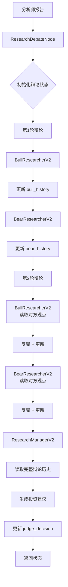

# v2.0 辩论执行器设计

## ⚠️ 重要更正

**本文档基于错误理解编写，v2.0 辩论执行器已经实现！**

---

## ✅ v2.0 辩论执行器现状

### 已实现的功能

v2.0 工作流引擎**已经包含完整的辩论循环逻辑**！

**实现位置**: `core/workflow/builder.py`

1. ✅ **辩论节点** (`_create_debate_node()` 第 1472-1540 行)
   - 初始化辩论状态
   - 支持投资辩论和风险辩论

2. ✅ **条件边循环** (`_add_participant_conditional_edge()` 第 1590-1648 行)
   - 多轮辩论路由逻辑
   - 自动检查 `count < max_count`

3. ✅ **辩论参与者包装器** (`_create_debate_participant_wrapper()`)
   - 自动递增计数器
   - 确保按轮次执行

4. ✅ **动态轮次配置**
   - 支持 `_max_debate_rounds` 和 `_max_risk_rounds`
   - 根据分析深度（1-5级）动态调整

---

## 📋 原问题定义（已解决）

### ~~当前问题~~（已不存在）

~~v2.0 工作流引擎**缺少辩论循环逻辑**，导致：~~

1. ~~❌ BullResearcherV2 和 BearResearcherV2 只执行一次~~
2. ~~❌ 没有多轮辩论交锋~~
3. ~~❌ 无法实现观点反驳和完善~~
4. ~~❌ ResearchManagerV2 无法综合辩论历史~~

**更正**：以上问题**不存在**，工作流层已经实现了多轮辩论！

### v1.x 实现（旧版，已淘汰）

**文件**: `tradingagents/core/engine/phase_executors/research_debate.py`

```python
class ResearchDebatePhase(PhaseExecutor):
    """研究辩论阶段执行器（v1.x）"""

    def execute(self, context: AnalysisContext) -> None:
        # 1. 收集分析师报告
        analyst_reports = self._collect_analyst_reports(context)

        # 2. 初始化辩论状态
        state = self._build_initial_state(context, analyst_reports)

        # 3. 多轮辩论循环
        for round_num in range(self.debate_rounds):
            # 看涨研究员发言
            state = self._run_bull_researcher(state)

            # 看跌研究员发言
            state = self._run_bear_researcher(state)

        # 4. 研究经理总结
        state = self._run_research_manager(state)

        # 5. 保存结果
        context.set(DataLayer.REPORTS, "bull_report", state["bull_history"])
        context.set(DataLayer.REPORTS, "bear_report", state["bear_history"])
        context.set(DataLayer.DECISIONS, "investment_plan", state["investment_plan"])
```

### v2.0 实现（新版，已实现）

**文件**: `core/workflow/builder.py`

v2.0 使用 **LangGraph 条件边** 实现辩论循环，而不是 Python for 循环：

```python
# 1. 辩论节点初始化状态
def debate_node(state):
    state["investment_debate_state"] = {
        "bull_history": "",
        "bear_history": "",
        "history": "",
        "current_response": "",
        "judge_decision": "",
        "count": 0,
    }
    return state

# 2. 条件边控制循环
def router(state):
    count = state.get("_debate_debate_count", 0)
    max_count = state.get("_max_debate_rounds", 2) * 2  # 2个参与者

    if count >= max_count:
        return "research_manager"  # 结束辩论
    else:
        # 轮流发言
        if count % 2 == 0:
            return "bull_researcher_v2"
        else:
            return "bear_researcher_v2"

# 3. 构建图
graph.add_node("debate", debate_node)
graph.add_node("bull_researcher_v2", bull_agent)
graph.add_node("bear_researcher_v2", bear_agent)
graph.add_node("research_manager", manager_agent)

graph.add_edge("debate", "bull_researcher_v2")
graph.add_conditional_edges("bull_researcher_v2", router, [...])
graph.add_conditional_edges("bear_researcher_v2", router, [...])
```

**优势**：
- ✅ 完全利用 LangGraph 的能力
- ✅ 可视化清晰
- ✅ 支持动态轮次配置
- ✅ 易于调试和监控

---

## 🎯 ~~设计目标~~（已实现）

### ~~核心目标~~（已完成）

1. ✅ ~~在 v2.0 工作流引擎中实现辩论循环~~ - **已实现**
2. ✅ ~~支持配置化的辩论轮次~~ - **已实现**
3. ✅ ~~兼容 LangGraph 架构~~ - **已实现**
4. ✅ ~~保持工作流定义的灵活性~~ - **已实现**

### 剩余工作

- ❌ **Agent 层需要增强**：读取和更新辩论状态
- ❌ **提示词需要更新**：包含辩论上下文
- 详见：`debate-mechanism-enhancement.md`

---

## 🏗️ ~~架构设计~~（已实现）

### ~~方案 1: 自定义节点~~（未采用）

~~在 LangGraph 中创建一个**辩论节点**，内部包含循环逻辑。~~

**注意**：v2.0 **没有采用**这个方案，而是使用了方案 2（条件边 + 循环）。

```python
# core/workflow/nodes/debate_node.py

class DebateNode:
    """辩论节点 - 封装多轮辩论逻辑"""
    
    def __init__(
        self,
        bull_agent: BullResearcherV2,
        bear_agent: BearResearcherV2,
        manager_agent: ResearchManagerV2,
        debate_rounds: int = 2
    ):
        self.bull_agent = bull_agent
        self.bear_agent = bear_agent
        self.manager_agent = manager_agent
        self.debate_rounds = debate_rounds
    
    def __call__(self, state: Dict[str, Any]) -> Dict[str, Any]:
        """执行辩论流程"""
        # 1. 初始化辩论状态
        if "investment_debate_state" not in state:
            state["investment_debate_state"] = {
                "history": "",
                "bull_history": "",
                "bear_history": "",
                "current_response": "",
                "count": 0,
                "judge_decision": ""
            }
        
        # 2. 多轮辩论循环
        for round_num in range(self.debate_rounds):
            logger.info(f"💬 辩论第 {round_num + 1}/{self.debate_rounds} 轮")
            
            # 看涨研究员发言
            bull_result = self.bull_agent.execute(state)
            state.update(bull_result)
            
            # 看跌研究员发言
            bear_result = self.bear_agent.execute(state)
            state.update(bear_result)
        
        # 3. 研究经理总结
        manager_result = self.manager_agent.execute(state)
        state.update(manager_result)
        
        return state
```

~~**优点**~~:
- ~~✅ 封装清晰，逻辑集中~~
- ~~✅ 易于测试和维护~~
- ~~✅ 不影响其他节点~~

~~**缺点**~~:
- ~~⚠️ 需要在工作流定义中特殊处理~~
- ~~⚠️ 不够灵活（辩论逻辑固定）~~

---

### 方案 2: 条件边 + 循环（✅ 已采用）

**v2.0 实际采用的方案**：使用 LangGraph 的条件边实现辩论循环。

**实现位置**: `core/workflow/builder.py` 第 1590-1648 行

```python
# core/workflow/builder.py

def _build_debate_workflow(self, workflow_def: Dict) -> StateGraph:
    """构建辩论工作流"""
    graph = StateGraph(dict)
    
    # 添加节点
    graph.add_node("bull_researcher", self._create_agent_node("bull_researcher_v2"))
    graph.add_node("bear_researcher", self._create_agent_node("bear_researcher_v2"))
    graph.add_node("research_manager", self._create_agent_node("research_manager_v2"))
    
    # 添加条件边 - 控制辩论循环
    def should_continue_debate(state: Dict) -> str:
        """判断是否继续辩论"""
        debate_state = state.get("investment_debate_state", {})
        count = debate_state.get("count", 0)
        max_count = 2 * self.debate_rounds  # 每轮2次发言
        
        if count >= max_count:
            return "research_manager"  # 结束辩论，进入总结
        
        # 判断下一个发言者
        current_response = debate_state.get("current_response", "")
        if current_response.startswith("Bull"):
            return "bear_researcher"
        else:
            return "bull_researcher"
    
    # 构建图结构
    graph.set_entry_point("bull_researcher")
    
    # 看涨 -> 条件判断
    graph.add_conditional_edges(
        "bull_researcher",
        should_continue_debate,
        {
            "bear_researcher": "bear_researcher",
            "research_manager": "research_manager"
        }
    )
    
    # 看跌 -> 条件判断
    graph.add_conditional_edges(
        "bear_researcher",
        should_continue_debate,
        {
            "bull_researcher": "bull_researcher",
            "research_manager": "research_manager"
        }
    )
    
    # 研究经理 -> 结束
    graph.add_edge("research_manager", END)
    
    return graph.compile()
```

**优点**:
- ✅ 完全利用 LangGraph 的能力
- ✅ 灵活可配置
- ✅ 可视化清晰

**缺点**:
- ⚠️ 实现复杂
- ⚠️ 调试困难

---

### 方案 3: 混合方案（推荐实施）

结合方案 1 和方案 2 的优点：
- 使用**辩论节点**封装核心逻辑
- 在工作流定义中支持**辩论模式**配置

```python
# core/workflow/nodes/debate_node.py

class ResearchDebateNode:
    """研究辩论节点（v2.0）"""

    def __init__(self, config: Dict[str, Any]):
        """
        初始化辩论节点

        Args:
            config: 配置字典
                - debate_rounds: 辩论轮次（默认 2）
                - bull_agent_id: 看涨研究员 ID
                - bear_agent_id: 看跌研究员 ID
                - manager_agent_id: 研究经理 ID
        """
        self.debate_rounds = config.get("debate_rounds", 2)
        self.bull_agent_id = config.get("bull_agent_id", "bull_researcher_v2")
        self.bear_agent_id = config.get("bear_agent_id", "bear_researcher_v2")
        self.manager_agent_id = config.get("manager_agent_id", "research_manager_v2")

        # Agent 实例（延迟加载）
        self.bull_agent = None
        self.bear_agent = None
        self.manager_agent = None

    def _initialize_agents(self, state: Dict[str, Any]) -> None:
        """初始化 Agent 实例"""
        if self.bull_agent is None:
            from core.agents import create_agent

            # 从 state 中获取 LLM 配置
            llm_config = state.get("llm_config", {})

            self.bull_agent = create_agent(self.bull_agent_id, llm_config)
            self.bear_agent = create_agent(self.bear_agent_id, llm_config)
            self.manager_agent = create_agent(self.manager_agent_id, llm_config)

    def _initialize_debate_state(self, state: Dict[str, Any]) -> None:
        """初始化辩论状态"""
        if "investment_debate_state" not in state:
            state["investment_debate_state"] = {
                "history": "",
                "bull_history": "",
                "bear_history": "",
                "current_response": "",
                "count": 0,
                "judge_decision": ""
            }

    def __call__(self, state: Dict[str, Any]) -> Dict[str, Any]:
        """
        执行辩论流程

        Args:
            state: 工作流状态

        Returns:
            更新后的状态
        """
        logger.info("=" * 80)
        logger.info("💬 [ResearchDebateNode] 开始研究辩论")
        logger.info("=" * 80)

        # 1. 初始化
        self._initialize_agents(state)
        self._initialize_debate_state(state)

        # 2. 多轮辩论
        for round_num in range(self.debate_rounds):
            logger.info(f"💬 辩论第 {round_num + 1}/{self.debate_rounds} 轮")

            # 看涨研究员发言
            logger.info("🐂 看涨研究员发言...")
            bull_result = self.bull_agent.execute(state)
            self._merge_result(state, bull_result)

            # 看跌研究员发言
            logger.info("🐻 看跌研究员发言...")
            bear_result = self.bear_agent.execute(state)
            self._merge_result(state, bear_result)

        # 3. 研究经理总结
        logger.info("👔 研究经理总结...")
        manager_result = self.manager_agent.execute(state)
        self._merge_result(state, manager_result)

        logger.info("✅ [ResearchDebateNode] 研究辩论完成")

        return state

    def _merge_result(self, state: Dict[str, Any], result: Dict[str, Any]) -> None:
        """合并 Agent 执行结果到状态"""
        for key, value in result.items():
            if key == "investment_debate_state":
                # 辩论状态需要合并，不是覆盖
                state[key].update(value)
            else:
                state[key] = value
```

**工作流定义示例**:

```json
{
  "workflow_id": "stock_analysis_v2",
  "name": "股票分析工作流 v2.0",
  "nodes": [
    {
      "id": "fundamentals_analyst",
      "type": "agent",
      "agent_id": "fundamentals_analyst_v2"
    },
    {
      "id": "market_analyst",
      "type": "agent",
      "agent_id": "market_analyst_v2"
    },
    {
      "id": "research_debate",
      "type": "debate",
      "config": {
        "debate_rounds": 2,
        "bull_agent_id": "bull_researcher_v2",
        "bear_agent_id": "bear_researcher_v2",
        "manager_agent_id": "research_manager_v2"
      }
    }
  ],
  "edges": [
    {"from": "fundamentals_analyst", "to": "market_analyst"},
    {"from": "market_analyst", "to": "research_debate"}
  ]
}
```

**优点**:
- ✅ 封装清晰，易于维护
- ✅ 配置灵活，支持自定义
- ✅ 兼容现有工作流引擎
- ✅ 易于测试

---

## 📝 实施方案（推荐方案 3）

### 阶段 1: 创建辩论节点

**文件**: `core/workflow/nodes/debate_node.py`

**任务**:
1. 实现 `ResearchDebateNode` 类
2. 实现 `RiskDebateNode` 类（风险辩论）
3. 编写单元测试

**测试**:
```python
# tests/core/workflow/nodes/test_debate_node.py

def test_research_debate_node():
    """测试研究辩论节点"""
    config = {
        "debate_rounds": 2,
        "bull_agent_id": "bull_researcher_v2",
        "bear_agent_id": "bear_researcher_v2",
        "manager_agent_id": "research_manager_v2"
    }

    node = ResearchDebateNode(config)

    state = {
        "ticker": "AAPL",
        "market_report": "...",
        "fundamentals_report": "..."
    }

    result = node(state)

    # 验证辩论状态
    assert "investment_debate_state" in result
    assert result["investment_debate_state"]["count"] >= 4  # 2轮 = 4次发言
    assert result["investment_debate_state"]["bull_history"]
    assert result["investment_debate_state"]["bear_history"]
    assert result["investment_debate_state"]["judge_decision"]
```

---

### 阶段 2: 扩展工作流构建器

**文件**: `core/workflow/builder.py`

**修改内容**:

```python
class WorkflowBuilder:
    """工作流构建器（增强版）"""

    def _create_node(self, node_def: Dict[str, Any]) -> Callable:
        """
        创建节点（支持多种类型）

        Args:
            node_def: 节点定义
                - type: "agent" | "debate" | "custom"
                - agent_id: Agent ID（type=agent 时）
                - config: 配置（type=debate 时）

        Returns:
            节点函数
        """
        node_type = node_def.get("type", "agent")

        if node_type == "agent":
            # 普通 Agent 节点
            agent_id = node_def["agent_id"]
            return self._create_agent_node(agent_id)

        elif node_type == "debate":
            # 辩论节点
            config = node_def.get("config", {})

            # 判断辩论类型
            if "bull_agent_id" in config:
                # 研究辩论
                from core.workflow.nodes.debate_node import ResearchDebateNode
                return ResearchDebateNode(config)
            elif "risky_agent_id" in config:
                # 风险辩论
                from core.workflow.nodes.debate_node import RiskDebateNode
                return RiskDebateNode(config)
            else:
                raise ValueError("未知的辩论类型")

        elif node_type == "custom":
            # 自定义节点
            module_path = node_def["module"]
            class_name = node_def["class"]
            config = node_def.get("config", {})

            # 动态导入
            module = importlib.import_module(module_path)
            node_class = getattr(module, class_name)
            return node_class(config)

        else:
            raise ValueError(f"未知的节点类型: {node_type}")

    def build(self, workflow_def: Dict[str, Any]) -> CompiledGraph:
        """构建工作流"""
        graph = StateGraph(dict)

        # 添加节点
        for node_def in workflow_def["nodes"]:
            node_id = node_def["id"]
            node_func = self._create_node(node_def)
            graph.add_node(node_id, node_func)

        # 添加边
        for edge_def in workflow_def["edges"]:
            graph.add_edge(edge_def["from"], edge_def["to"])

        # 设置入口点
        entry_point = workflow_def.get("entry_point", workflow_def["nodes"][0]["id"])
        graph.set_entry_point(entry_point)

        return graph.compile()
```

---

### 阶段 3: 更新工作流定义

**文件**: 数据库 `workflow_definitions` 集合

**更新脚本**: `scripts/update_workflow_with_debate.py`

```python
"""
更新工作流定义，添加辩论节点
"""
from app.core.database import get_mongo_db_sync

def update_stock_analysis_workflow():
    """更新股票分析工作流"""
    db = get_mongo_db_sync()
    collection = db["workflow_definitions"]

    # 查找工作流
    workflow = collection.find_one({"workflow_id": "stock_analysis_v2"})

    if not workflow:
        print("❌ 未找到工作流定义")
        return

    # 更新节点定义
    nodes = workflow.get("nodes", [])

    # 移除旧的研究员节点
    nodes = [n for n in nodes if n["id"] not in ["bull_researcher", "bear_researcher", "research_manager"]]

    # 添加辩论节点
    debate_node = {
        "id": "research_debate",
        "type": "debate",
        "config": {
            "debate_rounds": 2,
            "bull_agent_id": "bull_researcher_v2",
            "bear_agent_id": "bear_researcher_v2",
            "manager_agent_id": "research_manager_v2"
        }
    }
    nodes.append(debate_node)

    # 更新边
    edges = workflow.get("edges", [])
    # ... 更新边的逻辑

    # 保存
    collection.update_one(
        {"_id": workflow["_id"]},
        {"$set": {"nodes": nodes, "edges": edges}}
    )

    print("✅ 工作流定义已更新")

if __name__ == "__main__":
    update_stock_analysis_workflow()
```

---

## 🧪 测试计划

### 单元测试

```python
# tests/core/workflow/nodes/test_debate_node.py

class TestResearchDebateNode:
    """研究辩论节点测试"""

    def test_initialization(self):
        """测试初始化"""
        config = {"debate_rounds": 2}
        node = ResearchDebateNode(config)
        assert node.debate_rounds == 2

    def test_debate_execution(self):
        """测试辩论执行"""
        # ... 测试逻辑

    def test_state_merging(self):
        """测试状态合并"""
        # ... 测试逻辑
```

### 集成测试

```python
# tests/integration/test_workflow_with_debate.py

def test_workflow_with_debate_node():
    """测试包含辩论节点的工作流"""
    # 1. 构建工作流
    workflow_def = {...}
    builder = WorkflowBuilder()
    workflow = builder.build(workflow_def)

    # 2. 执行工作流
    state = {"ticker": "AAPL", ...}
    result = workflow.invoke(state)

    # 3. 验证结果
    assert "investment_debate_state" in result
    assert result["investment_debate_state"]["count"] >= 4
```

---

## 📊 数据流图



---

## 📋 实施检查清单

### 阶段 1: 辩论节点 ✅
- [ ] 创建 `core/workflow/nodes/debate_node.py`
- [ ] 实现 `ResearchDebateNode`
- [ ] 实现 `RiskDebateNode`
- [ ] 编写单元测试
- [ ] 代码审查

### 阶段 2: 工作流构建器 ✅
- [ ] 修改 `core/workflow/builder.py`
- [ ] 支持 `type="debate"` 节点
- [ ] 编写单元测试
- [ ] 集成测试

### 阶段 3: 工作流定义 ✅
- [ ] 编写更新脚本
- [ ] 更新数据库定义
- [ ] 验证工作流
- [ ] 端到端测试

### 阶段 4: 文档和示例 ✅
- [ ] 更新 API 文档
- [ ] 编写使用示例
- [ ] 更新架构图

---

**最后更新**: 2026-01-15
**作者**: TradingAgents-CN Pro Team
**状态**: 设计完成，待实施


