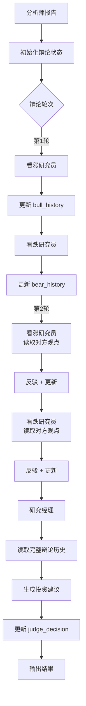
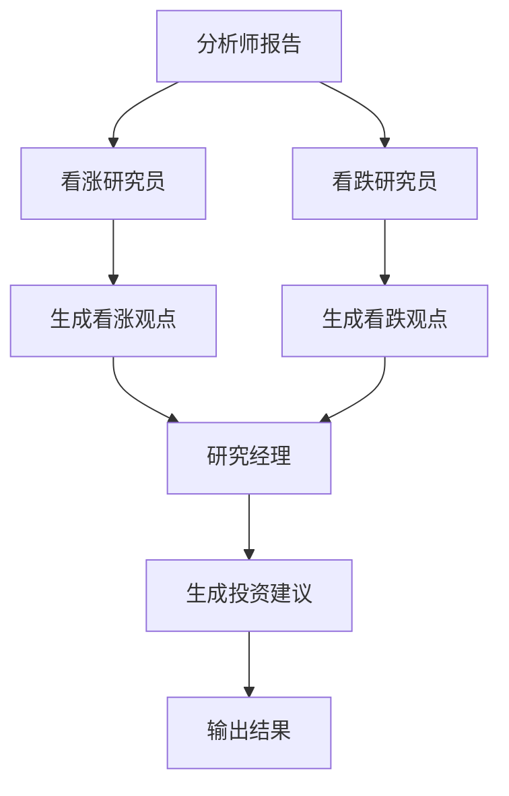

# v2.0 辩论机制增强设计（修正版）

## 📋 问题概述

### ✅ v2.0 已有的辩论基础设施

**重要发现**：v2.0 工作流层**已经实现了完整的辩论循环机制**！

**实现位置**: `core/workflow/builder.py`

1. ✅ **辩论节点** (`NodeType.DEBATE`)
   - 初始化 `investment_debate_state` 或 `risk_debate_state`
   - 设置初始计数器和历史字段

2. ✅ **条件边循环**
   - 通过 `_add_participant_conditional_edge()` 实现多轮辩论
   - 自动检查 `count < max_count` 决定继续或结束

3. ✅ **辩论参与者包装器**
   - 自动递增辩论计数器
   - 确保按轮次执行

4. ✅ **动态轮次配置**
   - 支持 `_max_debate_rounds` 和 `_max_risk_rounds`
   - 根据分析深度（1-5级）动态调整

### ❌ Agent 层缺失的功能

虽然工作流会多轮调用研究员，但 Agent 层**没有利用辩论状态**：

1. ❌ **ResearcherAgent 不读取辩论历史**
   - `execute()` 方法中没有检查 `investment_debate_state`
   - `_build_user_prompt()` 中没有包含对方观点

2. ❌ **ResearcherAgent 不更新辩论状态**
   - 没有更新 `bull_history` 或 `bear_history`
   - 没有更新 `current_response`

3. ❌ **提示词模板缺少辩论上下文**
   - 没有 `{opponent_view}` 变量
   - 没有 `{debate_history}` 变量
   - 没有反驳和完善的引导

4. ❌ **缺少 Memory 系统集成**
   - 无法从历史经验中学习

**结果**：
- 工作流会调用研究员 2-3 轮
- 但每次都是"独立分析"，没有辩论交锋
- ResearchManagerV2 无法看到辩论历史

### 旧版 (v1.x) 的辩论功能（参考）

旧版研究员具备完整的辩论能力：

```python
# tradingagents/agents/researchers/bull_researcher.py

# 1. 读取辩论状态
investment_debate_state = state.get("investment_debate_state", {})
history = investment_debate_state.get("history", "")
bull_history = investment_debate_state.get("bull_history", "")
current_response = investment_debate_state.get("current_response", "")  # 对方观点

# 2. 在提示词中使用辩论历史
prompt = f"""
辩论对话历史：{history}
最后的看跌论点：{current_response}
类似情况的反思和经验教训：{past_memory_str}
"""

# 3. 更新辩论状态
new_investment_debate_state = {
    "history": history + "\n" + argument,
    "bull_history": bull_history + "\n" + argument,
    "bear_history": investment_debate_state.get("bear_history", ""),
    "current_response": argument,
    "count": investment_debate_state.get("count", 0) + 1,
}

return {"investment_debate_state": new_investment_debate_state}
```

---

## 🎯 设计目标（修正版）

### 核心目标

1. ✅ **增强 ResearcherAgent 基类**：读取和更新辩论状态
2. ✅ **更新提示词模板**：包含辩论上下文变量
3. ✅ **集成 Memory 系统**：从历史经验中学习
4. ✅ **保持向后兼容**：单次分析模式仍然工作

### 非目标

- ❌ **不修改工作流层**：辩论循环已经实现
- ❌ **不创建辩论执行器**：已经存在
- ❌ **不修改 Agent 核心接口**：保持 `execute(state) -> dict` 签名
- ❌ **不破坏现有功能**：单次分析、交易复盘等场景

---

## 🏗️ 架构设计

### 1. 辩论状态结构（已由工作流层初始化）

**位置**: `core/workflow/builder.py` 第 1493-1521 行

```python
# 投资辩论状态（Investment Debate State）
# 由辩论节点自动初始化
investment_debate_state = {
    "history": "",               # 完整辩论历史
    "bull_history": "",          # 看涨方历史
    "bear_history": "",          # 看跌方历史
    "current_response": "",      # 最新发言
    "judge_decision": "",        # 裁判决策（研究经理填写）
    "count": 0,                  # 发言次数（自动递增）
}

# 风险辩论状态（Risk Debate State）
# 由风险辩论节点自动初始化
risk_debate_state = {
    "history": "",               # 完整辩论历史
    "risky_history": "",         # 激进方历史
    "safe_history": "",          # 保守方历史
    "neutral_history": "",       # 中立方历史
    "current_risky_response": "",
    "current_safe_response": "",
    "current_neutral_response": "",
    "latest_speaker": "",        # 最新发言者
    "judge_decision": "",        # 裁判决策（风险经理填写）
    "count": 0,                  # 发言次数（自动递增）
}
```

**注意**：
- ✅ 状态由工作流层初始化，Agent 层**只需读取和更新**
- ✅ `count` 由辩论参与者包装器自动递增，Agent 层**不需要管理**

---

### 2. ResearcherAgent 基类增强

**文件**: `core/agents/researcher.py`

#### 新增属性

```python
class ResearcherAgent(BaseAgent):
    """研究员 Agent 基类（增强版）"""

    # 辩论相关属性
    stance: str = "neutral"  # bull/bear/risky/safe/neutral
    debate_state_field: str = "investment_debate_state"  # 或 "risk_debate_state"
    history_field: str = None  # "bull_history", "bear_history" 等
    opponent_field: str = None  # 对方的 history 字段
    
    # 研究立场（子类覆盖）
    stance: str = "neutral"  # bull/bear/risky/safe/neutral
    
    # 辩论状态字段名（子类覆盖）
    debate_state_field: str = "investment_debate_state"  # 或 "risk_debate_state"
    
    # 历史字段名（子类覆盖）
    history_field: str = "bull_history"  # 或 "bear_history" 等
    
    def execute(self, state: Dict[str, Any]) -> Dict[str, Any]:
        """执行研究分析（支持辩论模式）"""
        # 1. 检测是否为辩论模式
        is_debate_mode = self._is_debate_mode(state)
        
        # 2. 收集报告
        reports = self._collect_reports(state)
        
        # 3. 获取历史上下文
        if is_debate_mode:
            historical_context = self._get_debate_context(state)
        else:
            historical_context = self._get_memory_context(state)
        
        # 4. 构建提示词
        system_prompt = self._build_system_prompt(self.stance, state)
        user_prompt = self._build_user_prompt(
            ticker, analysis_date, reports, historical_context, state
        )
        
        # 5. 调用 LLM
        response = self._call_llm(system_prompt, user_prompt, state)
        
        # 6. 保存结果
        result = {self.output_field: response}
        
        # 7. 更新辩论状态（如果是辩论模式）
        if is_debate_mode:
            result = self._update_debate_state(state, response, result)
        
        return result

    def _is_debate_mode(self, state: Dict[str, Any]) -> bool:
        """检测是否为辩论模式"""
        return self.debate_state_field in state

    def _get_debate_context(self, state: Dict[str, Any]) -> str:
        """获取辩论上下文"""
        debate_state = state.get(self.debate_state_field, {})
        history = debate_state.get("history", "")
        current_response = debate_state.get("current_response", "")

        context = ""
        if history:
            context += f"\n【辩论历史】\n{history}\n"
        if current_response:
            context += f"\n【对方最新观点】\n{current_response}\n"

        return context

    def _get_memory_context(self, state: Dict[str, Any]) -> str:
        """获取记忆上下文（从 Memory 系统）"""
        if not self.memory:
            return ""

        # 构建当前情况描述
        reports = self._collect_reports(state)
        curr_situation = "\n\n".join([str(v) for v in reports.values() if v])

        # 检索相似历史
        past_memories = self.memory.get_memories(curr_situation, n_matches=2)

        memory_str = ""
        for i, rec in enumerate(past_memories, 1):
            memory_str += rec.get("recommendation", "") + "\n\n"

        if memory_str:
            return f"\n【历史经验】\n{memory_str}"

        return ""

    def _update_debate_state(
        self,
        state: Dict[str, Any],
        response: str,
        result: Dict[str, Any]
    ) -> Dict[str, Any]:
        """
        更新辩论状态

        注意：count 由工作流层的辩论参与者包装器自动递增，
        Agent 层不需要管理 count
        """
        debate_state = state.get(self.debate_state_field, {})

        # 格式化发言
        speaker_label = self._get_speaker_label()
        argument = f"{speaker_label}: {response}"

        # 构建新的辩论状态（不包含 count，由工作流层管理）
        new_debate_state = {
            "history": debate_state.get("history", "") + "\n" + argument,
            self.history_field: debate_state.get(self.history_field, "") + "\n" + argument,
            "current_response": argument,
        }

        # 保留其他字段（包括 count）
        for key in ["count", "judge_decision", "bull_history", "bear_history",
                    "risky_history", "safe_history", "neutral_history",
                    "latest_speaker", "current_risky_response",
                    "current_safe_response", "current_neutral_response"]:
            if key in debate_state and key not in new_debate_state:
                new_debate_state[key] = debate_state[key]

        # 更新最新发言者
        if "latest_speaker" in debate_state:
            new_debate_state["latest_speaker"] = self.stance

        result[self.debate_state_field] = new_debate_state
        return result

    def _get_speaker_label(self) -> str:
        """获取发言者标签"""
        labels = {
            "bull": "Bull Analyst",
            "bear": "Bear Analyst",
            "risky": "Risky Analyst",
            "safe": "Safe Analyst",
            "neutral": "Neutral Analyst",
        }
        return labels.get(self.stance, "Analyst")
```

---

## 📝 实现方案

### 阶段 1: 基类增强

**文件**: `core/agents/researcher.py`

**修改内容**:
1. 添加辩论相关属性：`stance`, `debate_state_field`, `history_field`
2. 添加辩论支持方法：
   - `_is_debate_mode()` - 检测辩论模式
   - `_get_debate_context()` - 获取辩论上下文
   - `_get_memory_context()` - 获取记忆上下文
   - `_update_debate_state()` - 更新辩论状态
   - `_get_speaker_label()` - 获取发言者标签
3. 修改 `execute()` 方法，集成辩论逻辑

**向后兼容**:
- 如果 `state` 中没有 `debate_state_field`，自动降级为单次分析模式
- 不影响现有的非辩论场景

### 阶段 2: 子类适配

**文件**:
- `core/agents/adapters/bull_researcher_v2.py`
- `core/agents/adapters/bear_researcher_v2.py`
- `core/agents/adapters/research_manager_v2.py`

**修改内容**:

#### BullResearcherV2
```python
class BullResearcherV2(ResearcherAgent):
    # 辩论配置
    stance = "bull"
    debate_state_field = "investment_debate_state"
    history_field = "bull_history"

    # 其他保持不变...
```

#### BearResearcherV2
```python
class BearResearcherV2(ResearcherAgent):
    # 辩论配置
    stance = "bear"
    debate_state_field = "investment_debate_state"
    history_field = "bear_history"

    # 其他保持不变...
```

#### ResearchManagerV2
```python
class ResearchManagerV2(ManagerAgent):
    # 辩论配置
    debate_state_field = "investment_debate_state"

    def execute(self, state: Dict[str, Any]) -> Dict[str, Any]:
        # 调用父类方法
        result = super().execute(state)

        # 读取辩论历史
        debate_state = state.get(self.debate_state_field, {})

        # 更新辩论状态（添加 judge_decision）
        new_debate_state = {
            **debate_state,
            "judge_decision": result.get(self.output_field, ""),
            "current_response": result.get(self.output_field, ""),
        }

        result[self.debate_state_field] = new_debate_state
        return result
```

### 阶段 3: 提示词模板增强

**文件**: 数据库 `prompt_templates` 集合

**新增模板变量**:
```python
# 辩论相关变量
{
    "debate_history": str,        # 完整辩论历史
    "opponent_view": str,         # 对方最新观点
    "past_memories": str,         # 历史经验
    "debate_round": int,          # 当前辩论轮次
}
```

**模板示例** (bull_researcher_v2 的 user_prompt):
```markdown
请从**理性看多**的角度分析"{company_name}"（{ticker}）。

**📊 可用分析报告**：

=== 市场分析报告 ===
{market_report}

=== 基本面分析报告 ===
{fundamentals_report}

...

{#if debate_history}
**💬 辩论历史**：
{debate_history}

**🎯 对方最新观点**：
{opponent_view}

请针对对方观点进行反驳，并提出更有力的看多论据。
{/if}

{#if past_memories}
**📚 历史经验**：
{past_memories}
{/if}

**📈 当前股价**: {current_price} {currency_symbol}（系统实时获取）

**注意**：如果某个报告为空或未提供，请明确说明"该报告未提供"，不要使用内部知识补充。
```

### 阶段 4: Memory 系统集成

**文件**: `core/agents/researcher.py`

**Memory 接口**:
```python
class MemoryInterface:
    """记忆系统接口（兼容旧版）"""

    def get_memories(self, situation: str, n_matches: int = 2) -> List[Dict[str, str]]:
        """
        检索相似历史记忆

        Args:
            situation: 当前情况描述
            n_matches: 返回匹配数量

        Returns:
            记忆列表，每个记忆包含 {"recommendation": str}
        """
        pass

    def add_situations(self, situations: List[Tuple[str, str]]) -> None:
        """
        添加新的记忆

        Args:
            situations: [(situation, recommendation), ...]
        """
        pass
```

**集成方式**:
```python
class ResearcherAgent(BaseAgent):
    def __init__(self, llm, memory=None, **kwargs):
        super().__init__(llm, **kwargs)
        self.memory = memory  # 可选的记忆系统

    def _get_memory_context(self, state: Dict[str, Any]) -> str:
        """获取记忆上下文"""
        if not self.memory:
            return ""

        # 构建当前情况
        reports = self._collect_reports(state)
        curr_situation = "\n\n".join([str(v) for v in reports.values() if v])

        # 检索历史
        try:
            past_memories = self.memory.get_memories(curr_situation, n_matches=2)
            memory_str = ""
            for rec in past_memories:
                memory_str += rec.get("recommendation", "") + "\n\n"

            if memory_str:
                return f"\n【历史经验】\n{memory_str}"
        except Exception as e:
            logger.warning(f"检索记忆失败: {e}")

        return ""
```

---

## 🔄 工作流集成

### ResearchDebateExecutor 适配

**文件**: `tradingagents/core/engine/phase_executors/research_debate.py`

**当前实现**:
```python
def _run_bull_researcher(self, state: Dict[str, Any]) -> Dict[str, Any]:
    """执行看多研究"""
    agent = self._get_bull_researcher()
    if agent:
        try:
            result = agent(state)  # 旧版：调用函数
            if "investment_debate_state" in result:
                state["investment_debate_state"] = result["investment_debate_state"]
        except Exception as e:
            logger.error(f"❌ [多头研究员] 执行失败: {e}")
    return state
```

**需要适配**:
```python
def _run_bull_researcher(self, state: Dict[str, Any]) -> Dict[str, Any]:
    """执行看多研究"""
    agent = self._get_bull_researcher()
    if agent:
        try:
            # 🔧 兼容新旧版本
            if callable(agent):
                # 旧版：函数式 Agent
                result = agent(state)
            else:
                # 新版：对象式 Agent
                result = agent.execute(state)

            # 合并辩论状态
            if "investment_debate_state" in result:
                state["investment_debate_state"] = result["investment_debate_state"]

            # 合并报告
            if "bull_report" in result:
                state["bull_report"] = result["bull_report"]

        except Exception as e:
            logger.error(f"❌ [多头研究员] 执行失败: {e}")
    return state
```

### 初始化辩论状态

**ResearchDebateExecutor._build_initial_state()**:
```python
def _build_initial_state(
    self,
    context: AnalysisContext,
    analyst_reports: Dict[str, str]
) -> Dict[str, Any]:
    """构建初始状态"""
    ticker = context.get(DataLayer.CONTEXT, "ticker") or ""
    trade_date = context.get(DataLayer.CONTEXT, "trade_date") or ""

    state = {
        "ticker": ticker,  # ✅ 新增：v2.0 需要
        "company_of_interest": ticker,  # 旧版兼容
        "trade_date": trade_date,
        "analysis_date": trade_date,  # ✅ 新增：v2.0 需要
        "messages": [],

        # 投资辩论状态
        "investment_debate_state": {
            "history": "",
            "bull_history": "",
            "bear_history": "",
            "current_response": "",
            "count": 0,
            "judge_decision": ""
        }
    }

    # 添加分析师报告
    for field, report in analyst_reports.items():
        state[field] = report

    # ✅ 新增：添加系统变量（v2.0 需要）
    state.update({
        "current_price": context.get(DataLayer.CONTEXT, "current_price", ""),
        "currency_symbol": context.get(DataLayer.CONTEXT, "currency_symbol", ""),
        "industry": context.get(DataLayer.CONTEXT, "industry", ""),
        "market_name": context.get(DataLayer.CONTEXT, "market_name", ""),
    })

    return state
```

---

## 🧪 测试计划

### 单元测试

**文件**: `tests/core/agents/test_researcher_debate.py`

```python
import pytest
from core.agents.adapters.bull_researcher_v2 import BullResearcherV2
from core.agents.adapters.bear_researcher_v2 import BearResearcherV2

def test_bull_researcher_debate_mode():
    """测试看涨研究员辩论模式"""
    llm = MockLLM()
    agent = BullResearcherV2(llm)

    state = {
        "ticker": "AAPL",
        "analysis_date": "2024-12-15",
        "market_report": "市场报告...",
        "investment_debate_state": {
            "history": "",
            "bull_history": "",
            "bear_history": "",
            "current_response": "Bear Analyst: 估值过高...",
            "count": 1,
        }
    }

    result = agent.execute(state)

    # 验证输出
    assert "bull_report" in result
    assert "investment_debate_state" in result

    # 验证辩论状态更新
    debate_state = result["investment_debate_state"]
    assert debate_state["count"] == 2
    assert "Bull Analyst:" in debate_state["bull_history"]
    assert "Bull Analyst:" in debate_state["history"]

def test_bull_researcher_single_mode():
    """测试看涨研究员单次分析模式"""
    llm = MockLLM()
    agent = BullResearcherV2(llm)

    state = {
        "ticker": "AAPL",
        "analysis_date": "2024-12-15",
        "market_report": "市场报告...",
        # 没有 investment_debate_state
    }

    result = agent.execute(state)

    # 验证输出
    assert "bull_report" in result
    # 不应该有辩论状态
    assert "investment_debate_state" not in result
```

### 集成测试

**文件**: `tests/integration/test_research_debate_workflow.py`

```python
def test_research_debate_workflow():
    """测试完整的研究辩论工作流"""
    # 1. 初始化
    executor = ResearchDebateExecutor(...)
    context = AnalysisContext(...)

    # 2. 执行辩论
    result = executor.execute(context)

    # 3. 验证结果
    assert context.has(DataLayer.REPORTS, "bull_report")
    assert context.has(DataLayer.REPORTS, "bear_report")
    assert context.has(DataLayer.DECISIONS, "investment_plan")

    # 4. 验证辩论状态
    debate_state = context.get(DataLayer.DECISIONS, "investment_debate_state")
    assert debate_state["count"] >= 2  # 至少一轮辩论
    assert debate_state["bull_history"]
    assert debate_state["bear_history"]
    assert debate_state["judge_decision"]
```

---

## 📊 数据流图

### 辩论模式数据流



### 单次分析模式数据流



---

## 🔍 关键技术细节

### 1. 辩论模式检测

```python
def _is_debate_mode(self, state: Dict[str, Any]) -> bool:
    """
    检测是否为辩论模式

    判断依据：
    1. state 中存在 debate_state_field（如 "investment_debate_state"）
    2. debate_state 是字典类型
    3. debate_state 包含必要字段（history, count 等）
    """
    if self.debate_state_field not in state:
        return False

    debate_state = state[self.debate_state_field]
    if not isinstance(debate_state, dict):
        return False

    # 检查必要字段
    required_fields = ["history", "count"]
    return all(field in debate_state for field in required_fields)
```

### 2. 辩论上下文构建

```python
def _get_debate_context(self, state: Dict[str, Any]) -> str:
    """
    构建辩论上下文

    包含：
    1. 完整辩论历史（所有发言）
    2. 对方最新观点（用于反驳）
    3. 当前辩论轮次
    """
    debate_state = state.get(self.debate_state_field, {})

    # 完整历史
    history = debate_state.get("history", "")

    # 对方最新观点
    current_response = debate_state.get("current_response", "")

    # 当前轮次
    count = debate_state.get("count", 0)
    round_num = (count // 2) + 1

    context = ""

    if history:
        context += f"\n【辩论历史】（第 {round_num} 轮）\n{history}\n"

    if current_response and not current_response.startswith(self._get_speaker_label()):
        # 只有当最新发言不是自己时，才显示为"对方观点"
        context += f"\n【对方最新观点】\n{current_response}\n"
        context += "\n请针对上述观点进行反驳，并提出更有力的论据。\n"

    return context
```

### 3. Memory 系统集成

```python
def _get_memory_context(self, state: Dict[str, Any]) -> str:
    """
    从 Memory 系统检索历史经验

    流程：
    1. 构建当前情况描述（所有报告的拼接）
    2. 使用向量相似度检索历史记忆
    3. 格式化为上下文字符串
    """
    if not self.memory:
        logger.debug("Memory 系统未配置，跳过历史经验检索")
        return ""

    try:
        # 构建当前情况
        reports = self._collect_reports(state)

        # 优先使用扩展报告（大盘、板块）
        situation_parts = []
        if "index_report" in reports and reports["index_report"]:
            situation_parts.append(f"【大盘分析】\n{reports['index_report']}")
        if "sector_report" in reports and reports["sector_report"]:
            situation_parts.append(f"【板块分析】\n{reports['sector_report']}")

        # 添加核心报告
        for key in ["market_report", "fundamentals_report", "news_report", "sentiment_report"]:
            if key in reports and reports[key]:
                situation_parts.append(str(reports[key]))

        curr_situation = "\n\n".join(situation_parts)

        # 检索历史
        past_memories = self.memory.get_memories(curr_situation, n_matches=2)

        if not past_memories:
            logger.debug("未找到相似的历史记忆")
            return ""

        # 格式化
        memory_str = ""
        for i, rec in enumerate(past_memories, 1):
            recommendation = rec.get("recommendation", "")
            if recommendation:
                memory_str += f"【经验 {i}】\n{recommendation}\n\n"

        if memory_str:
            return f"\n【历史经验】\n{memory_str}"

    except Exception as e:
        logger.warning(f"检索历史经验失败: {e}")

    return ""
```

### 4. 辩论状态更新

```python
def _update_debate_state(
    self,
    state: Dict[str, Any],
    response: str,
    result: Dict[str, Any]
) -> Dict[str, Any]:
    """
    更新辩论状态

    更新内容：
    1. history - 添加新发言
    2. {stance}_history - 添加到己方历史
    3. current_response - 更新为最新发言
    4. count - 发言次数 +1
    5. latest_speaker - 更新发言者（风险辩论需要）
    """
    debate_state = state.get(self.debate_state_field, {})

    # 格式化发言
    speaker_label = self._get_speaker_label()
    argument = f"{speaker_label}: {response}"

    # 获取现有历史
    history = debate_state.get("history", "")
    my_history = debate_state.get(self.history_field, "")

    # 构建新状态
    new_debate_state = {
        "history": (history + "\n" + argument).strip(),
        self.history_field: (my_history + "\n" + argument).strip(),
        "current_response": argument,
        "count": debate_state.get("count", 0) + 1,
    }

    # 保留其他历史字段
    history_fields = [
        "bull_history", "bear_history",
        "risky_history", "safe_history", "neutral_history"
    ]
    for field in history_fields:
        if field in debate_state and field != self.history_field:
            new_debate_state[field] = debate_state[field]

    # 保留其他字段
    for key in ["judge_decision", "latest_speaker",
                "current_risky_response", "current_safe_response",
                "current_neutral_response"]:
        if key in debate_state:
            new_debate_state[key] = debate_state[key]

    # 更新最新发言者（风险辩论）
    if "latest_speaker" in new_debate_state:
        new_debate_state["latest_speaker"] = self.stance

    result[self.debate_state_field] = new_debate_state

    logger.info(f"✅ 辩论状态已更新: count={new_debate_state['count']}, speaker={speaker_label}")

    return result
```

---

## 📋 实施检查清单

### 阶段 1: 基类增强 ✅
- [ ] 修改 `core/agents/researcher.py`
  - [ ] 添加辩论相关属性
  - [ ] 实现 `_is_debate_mode()`
  - [ ] 实现 `_get_debate_context()`
  - [ ] 实现 `_get_memory_context()`
  - [ ] 实现 `_update_debate_state()`
  - [ ] 实现 `_get_speaker_label()`
  - [ ] 修改 `execute()` 方法
- [ ] 编写单元测试
- [ ] 验证向后兼容性

### 阶段 2: 子类适配 ✅
- [ ] 修改 `core/agents/adapters/bull_researcher_v2.py`
  - [ ] 设置 `stance = "bull"`
  - [ ] 设置 `debate_state_field = "investment_debate_state"`
  - [ ] 设置 `history_field = "bull_history"`
- [ ] 修改 `core/agents/adapters/bear_researcher_v2.py`
  - [ ] 设置 `stance = "bear"`
  - [ ] 设置 `debate_state_field = "investment_debate_state"`
  - [ ] 设置 `history_field = "bear_history"`
- [ ] 修改 `core/agents/adapters/research_manager_v2.py`
  - [ ] 增强 `execute()` 方法
  - [ ] 读取辩论历史
  - [ ] 更新 `judge_decision`
- [ ] 编写单元测试

### 阶段 3: 提示词模板 ✅
- [ ] 更新数据库模板
  - [ ] `bull_researcher_v2` 的 `user_prompt`
  - [ ] `bear_researcher_v2` 的 `user_prompt`
  - [ ] `research_manager_v2` 的 `user_prompt`
- [ ] 添加辩论相关变量
  - [ ] `debate_history`
  - [ ] `opponent_view`
  - [ ] `past_memories`
  - [ ] `debate_round`
- [ ] 测试模板渲染

### 阶段 4: 工作流集成 ✅
- [ ] 修改 `tradingagents/core/engine/phase_executors/research_debate.py`
  - [ ] 适配 `_run_bull_researcher()`
  - [ ] 适配 `_run_bear_researcher()`
  - [ ] 适配 `_run_research_manager()`
  - [ ] 增强 `_build_initial_state()`
- [ ] 编写集成测试
- [ ] 端到端测试

### 阶段 5: Memory 系统 ✅
- [ ] 定义 Memory 接口
- [ ] 实现 Memory 适配器（如果需要）
- [ ] 集成到 ResearcherAgent
- [ ] 测试记忆检索和保存

### 阶段 6: 文档和示例 ✅
- [ ] 更新 API 文档
- [ ] 编写使用示例
- [ ] 更新架构图
- [ ] 编写迁移指南

---

## 🚀 发布计划

### v2.1.0 - 辩论机制增强

**发布内容**:
1. ✅ ResearcherAgent 基类支持辩论模式
2. ✅ BullResearcherV2/BearResearcherV2 支持多轮辩论
3. ✅ ResearchManagerV2 读取辩论历史
4. ✅ Memory 系统集成
5. ✅ 提示词模板增强

**向后兼容**:
- ✅ 单次分析模式仍然可用
- ✅ 不影响现有工作流
- ✅ 旧版 Agent 继续工作

**升级路径**:
1. 更新代码到 v2.1.0
2. 运行数据库迁移脚本（更新模板）
3. 测试现有工作流
4. 逐步启用辩论功能

---

## 📚 参考资料

### 相关文件
- `tradingagents/agents/researchers/bull_researcher.py` - 旧版看涨研究员
- `tradingagents/agents/researchers/bear_researcher.py` - 旧版看跌研究员
- `tradingagents/agents/managers/research_manager.py` - 旧版研究经理
- `core/agents/researcher.py` - v2.0 研究员基类
- `tradingagents/core/engine/phase_executors/research_debate.py` - 辩论执行器

### 相关文档
- `docs/agents/v0.1.13/researchers.md` - 研究员文档
- `docs/architecture/v0.1.13/graph-structure.md` - 图结构文档
- `tradingagents/agents/utils/agent_states.py` - 状态定义

---

**最后更新**: 2026-01-15
**作者**: TradingAgents-CN Pro Team
**版本**: v2.1.0 设计草案


