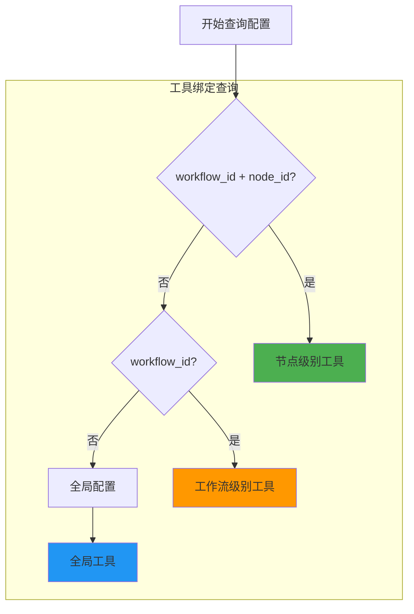
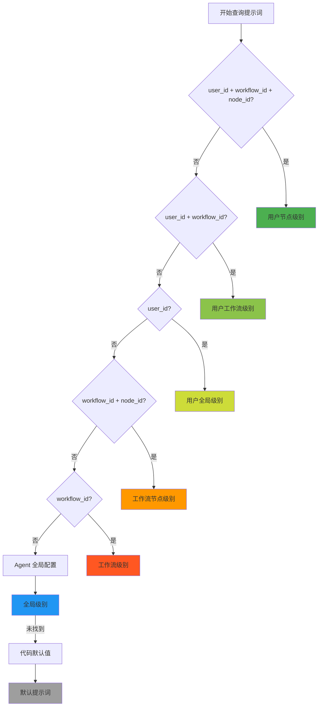
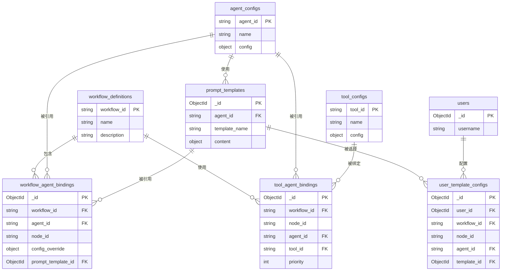
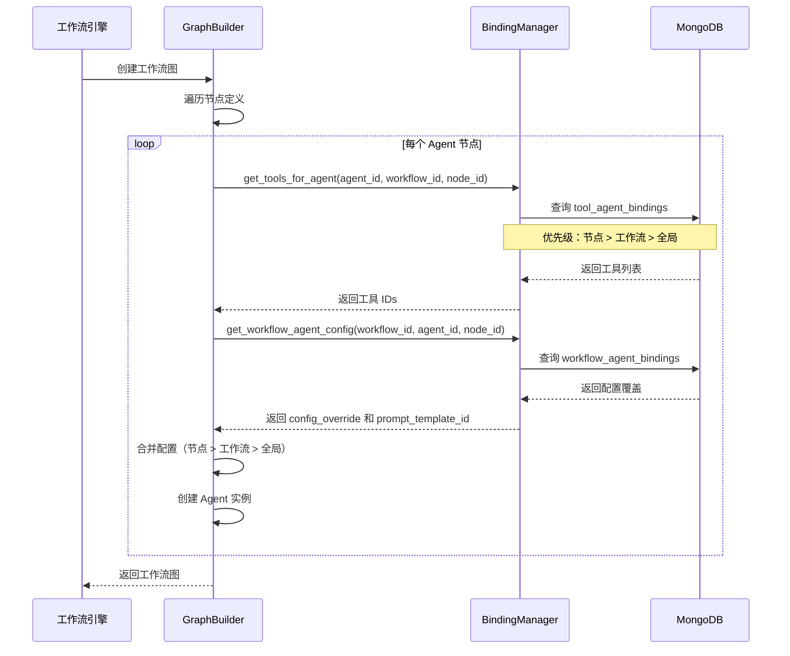
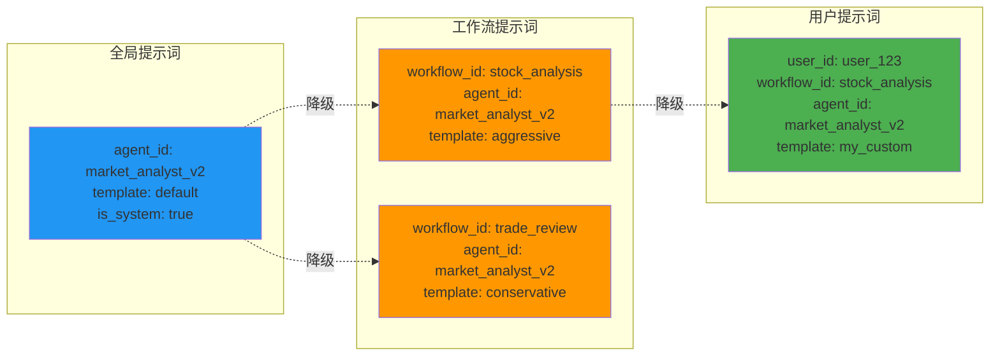
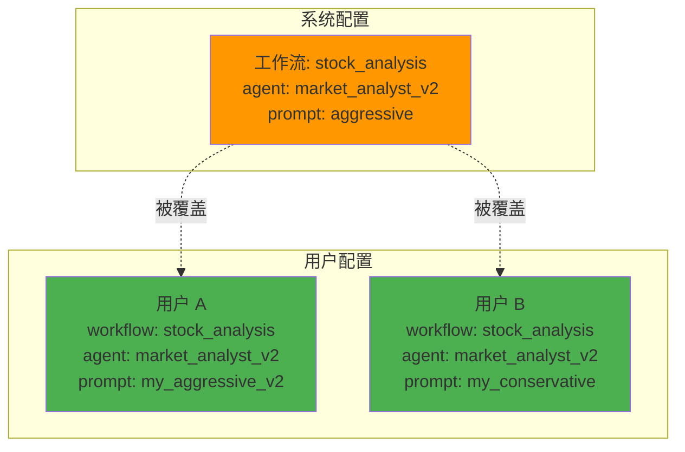

# v2.1 架构图

## 📊 配置层次架构

### 1. 配置优先级流程图



---

### 2. 提示词查询优先级



---

## 🗄️ 数据库关系图

### 1. 工作流上下文配置关系



---

### 2. 配置查询流程



---

## 🔄 配置继承关系

### 1. 工具绑定继承

```mermaid
graph LR
    subgraph "全局配置"
        G[agent_id: market_analyst_v2<br/>tools: [tool1, tool2]]
    end
    
    subgraph "工作流配置"
        W1[workflow_id: stock_analysis<br/>agent_id: market_analyst_v2<br/>tools: [tool3, tool4]]
        W2[workflow_id: trade_review<br/>agent_id: market_analyst_v2<br/>tools: [tool5]]
    end
    
    subgraph "节点配置"
        N1[workflow_id: stock_analysis<br/>node_id: market_node<br/>agent_id: market_analyst_v2<br/>tools: [tool6]]
    end
    
    G -.降级.-> W1
    G -.降级.-> W2
    W1 -.降级.-> N1
    
    style G fill:#2196f3
    style W1 fill:#ff9800
    style W2 fill:#ff9800
    style N1 fill:#4caf50
```

---

### 2. 提示词继承



---

## 🎯 使用场景示例

### 场景 1：同一 Agent 在不同工作流中的配置

```mermaid
graph TB
    subgraph "Agent: market_analyst_v2"
        A[全局配置<br/>tools: [get_stock_data]<br/>prompt: default]
    end
    
    subgraph "工作流 A: 股票分析"
        WA[工作流配置<br/>tools: [get_stock_data, get_technical_indicators]<br/>prompt: aggressive<br/>temperature: 0.9]
        
        NA1[节点 1: 技术分析<br/>tools: [get_technical_indicators]<br/>prompt: technical_focus]
        
        NA2[节点 2: 基本面分析<br/>tools: [get_fundamentals]<br/>prompt: fundamental_focus]
    end
    
    subgraph "工作流 B: 交易复盘"
        WB[工作流配置<br/>tools: [get_trade_records]<br/>prompt: conservative<br/>temperature: 0.3]
    end
    
    A -.降级.-> WA
    A -.降级.-> WB
    WA -.降级.-> NA1
    WA -.降级.-> NA2
    
    style A fill:#2196f3
    style WA fill:#ff9800
    style WB fill:#ff9800
    style NA1 fill:#4caf50
    style NA2 fill:#4caf50
```

---

### 场景 2：用户自定义配置覆盖



---

**创建日期**: 2026-01-09  
**最后更新**: 2026-01-09  
**维护者**: TradingAgents-CN Pro Team

